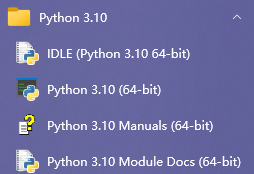
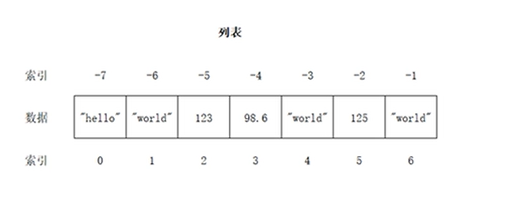
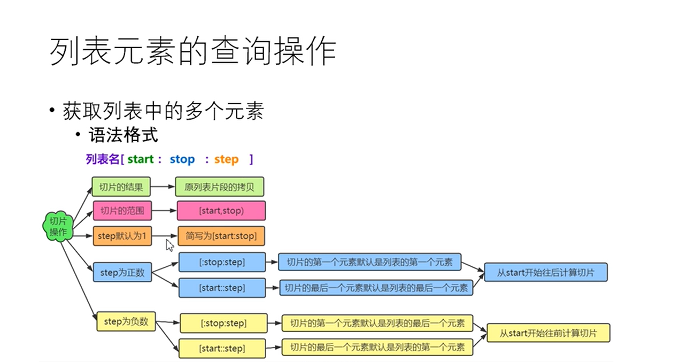

[TOC]


# 有了java基础，迅速学完Python并做了一份笔记-全套Python，建议收藏

# 北交练习

```
Week 9 | Hello Python

In this lab, you will be working independently.
If you’re not yet familiar with the Python development environment (PyCharm), please watch a tutorial—either one available on YouTube or the one I’ve uploaded for you.

Exercise 1: Hello Python
Write and run a small Python program that prints “hello, world”. To do so, open a file called hello.py,  write your code in it, save it, and run python hello.py.

Exercise 2: Hello You
Adapt your hello-world-program to instead ask for a name and then print hello, <name>.
Modify it again to print Hello: "<name>"

Exercise 3: Calculator
Write a python program that reads two numbers as input and then asks for one of the operations add,  subtract, multiply, divide, and power. The program should then print <a> <op> <b> = <a op b>, where a and b are the two numbers and op the operation.
For example, the program could do something like this:
1 	First: 11
2 	Second: 2
3 	Operation: +
4 	11 + 2 = 13

Exercise 4: Temperature Conversion
We want to write a conversion tool to convert between temperatures. The programme should be able to do conversions between Kelvin, Celsius, and Fahrenheit. To this end, your program should ask the user for a value, the unit in which it is given, and the unit we want to convert to. For example:
1 	Value: 23.2
2 	Unit: Celsius
3 	Conversion: Kelvin
4 	Value of 23.2°C is 296.35K

Loop up the conversion rates, write the program, and test it on several inputs.

Exercise 5: Factorial Calculator
Create a program that calculates the factorial of a non-negative integer, and print an
error message if the number is negative.
Try both with and without recursion.

Exercise 6: Prime Number Checker
Write a Python program that takes a number as input from the user and checks whether
it is a prime number or not. Create a boolean function is_prime(n) that takes a single integer parameter and returns True if the number is a prime, and False otherwise.
Prime Number Definition: A prime number is a natural number greater than 1 that has no positive divisors other than 1 and itself.
1.	Implement the following logic:
o	Basic Cases:
	If the number is less than or equal to 1 → Not prime
	If the number is 2 or 3 → Prime
o	Divisibility Checks:
	If the number is divisible by 2 or 3 → Not prime
	Otherwise, check divisibility from 5 to √n using a loop.
	Only check numbers of the form 6k ± 1 (i.e., increment by 6, checking i and i + 2 each time).
2.	In your main program, prompt the user to enter a number and use the is_prime() function to check whether it is a prime number.

```


```python
# Exercise 1
print("hello, world")

# Exercise 2
name = "hello"
print(name)

# Exercise 3
a = float(input("First: "))
b = float(input("Second: "))
op = input("Operation: ")

flag = True

if op == '+':
    result = a + b
elif op == '-':
    result = a - b
elif op == '*':
    result = a * b
elif op == '/':
    if b != 0:
        result = a / b
    else:
        flag = False
        result = "Error: Division by zero"
elif op == '**': # power NICE!!
    result = a ** b
else:
    result = "Error: Invalid operation"
    flag = False

if flag == True:
    print(result)


# Exercise 4
def convert_temperature():
    # Read input value
    value = float(input("Value: "))

    # Read current unit
    unit = input("Unit: ")

    # Read target unit
    conversion = input("Conversion: ")

    # Conversion formulas
    if unit == "Celsius":
        if conversion == "Kelvin":
            result = value + 273.15
        elif conversion == "Fahrenheit":
            result = (value * 9 / 5) + 32
        else:
            result = "Error: Invalid conversion unit"
    elif unit == "Kelvin":
        if conversion == "Celsius":
            result = value - 273.15
        elif conversion == "Fahrenheit":
            result = (value - 273.15) * 9 / 5 + 32
        else:
            result = "Error: Invalid conversion unit"
    elif unit == "Fahrenheit":
        if conversion == "Celsius":
            result = (value - 32) * 5 / 9
        elif conversion == "Kelvin":
            result = (value - 32) * 5 / 9 + 273.15
        else:
            result = "Error: Invalid conversion unit"
    else:
        result = "Error: Invalid input unit"

        # Print the result with correct symbols
        if isinstance(result, str) and result.startswith("Error"):
            print(result)
        else:
            # Determine the correct symbols for the units
            unit_symbol = "°C" if unit == "celsius" else ("K" if unit == "kelvin" else "F")
            conversion_symbol = "°C" if conversion == "celsius" else ("K" if conversion == "kelvin" else "F")

            # Using string concatenation with + and correct symbols
            print(str(value) + "°" + unit_symbol + " is " + "{:.2f}".format(result) + "°" + conversion_symbol)

convert_temperature()

# Exercise 5_recursive

def factorial_recursive(n):
    if n < 0:
        return -1
    elif n == 0 or n == 1:
        return 1
    else:
        return n * factorial_recursive(n - 1)

num = int(input("Enter a non-negative integer: "))
result = factorial_recursive(num)

if result == -1:
    print("Error: Negative number")
else:
    print("Factorial of " + num + " is " + result)

# Exercise 5_iterative

num = int(input("Enter a non-negative integer: "))
if num < 0:
    print("Error: Negative number")
else:
    result = 1 # Key!!
    for i in range(2, num + 1): # [ , )
        result *= i
    print("Factorial of " + num + " is " + result)

# Exercise 6
def is_prime(n):
    if n <= 1:
        return False
    else:
        flag = True
        for i in range(2, int(n ** 0.5) + 1):
            if n % i == 0:
                flag = False
                break
        return flag

number = int(input("Enter a number: "))
if(is_prime(num)):
    print(number + " is prime")
else:
    print(number + " is not prime")
```


# 正式讲解

## 面向过程

### Python简介

Python和Java的解释方式对比

Java：源代码 -> 编译成class -> Jvm解释运行

Python：源代码 -> Python解释器解释运行

我经常和身边的Java开发者开玩笑说：“Java真变态，别的语言都是要么直接编译要么直接解释，Java太另类了又编译又解释的......”

直接解释和编译后解释其实最大的区别就是源代码的安全性。

如果是直接解释源代码，那么源代码没有安全性可言，也就是任何一个人都可以打开源代码一看究竟，任何人都可以随意修改源代码。

事实上，Python和Java的解释方式是相同的，只是我们表面上看Python是直接解释源代码，而实际上python解释器只会加载字节码。细心的小伙伴肯定发现了这一点，当我们import某个模块时，总是会在模块所在的目录创建一个pycache目录，里面存放着被加载模块的字节码文件。

编译源代码有以下作用：

源代码保护（算法保护）/ 防止用户篡改源代码解释器加载代码速度加快

------


安装好py之后会有几个文件，如下：




- IDLE：是py自带的一种简单的开发环境

- Python+版本号：这个是python的交互式命令行程序

- Python+版本号+ Manuals是官方技术文档（API）

- Python+版本号+Module Docs是已安装模块的文档

#### Python输出

open('可以指定文件，将数据输出到对应文件中',a+")，a是以读写的方式创建，如果文件不存在的话就创建，存在的话就在文件后面追加

```python
fp=open('D：/text.txt','a+')

print('helloworld',file=fp)

fp.close
```


### 转移字符

什么是转义字符？

- 就是反斜杠+想要实现转移功能的首字母

- 当字符串中包含反斜杠、单引号和双引号等有特殊用途的字符时，必须使用反斜杠对这些字符进行转移

- 反斜杠：\ \ 这里都用空格隔开了，不然中间会转移

- 单引号：\ ' （可以适用于单引号里面加单引号）

- 双引号: \ "

- 换行:\n

- 回车：\r

- 退一个格：\b 'hello\bworld' 输出hellworld

- 水平制表符：\t，一个制表符占位置4个字符，hello\t这样占3个，因为hell算1个制表符，0算一个，剩下3个字符算一个制表符

- 退格：\b

- 原字符：不希望字符串中的转义字符起作用，就用元字符，就是在字符串前面加上r或R，如：print(r'hello\nworld') 中间不能有空格，否则报错

- 注意：最后一个字符不能写一个反斜线 \ ，能写两个

print(r'helloWorld\' ) 错误，这里为了demo，写了两个\才显示一个\


### Python基本类型

#### 关键字

```python
importkeyword

pring(keyword.kwlist)
```

变量的定义

```python
name='哈哈哈哈哈'

print('标识',id(name))

print('类型',type(name))

print('值',name)
```

输出：

```python
标识 2717730201040 内存地址,可以用id()输出内存地址，也就是标识

类型 <class 'str'>

值 哈哈哈哈哈

十进制-->默认的进制

八进制-->以0b开头

二进制-->以0o开头、

十六进制-->0x开头
```


#### 浮点数

进行浮点数计算的时候会因为二进制的底层问题导致不精确，我们要小心，不用深究

解决方案：

```python
导入模块decimal

#3.4000000000000004

print(1.2+2.2)

#导入Decimal之后 输出3.4

fromdecimalimportDecimal

print(1.2+2.2)

#3.4
```


#### 布尔型

true表示1

false表示0

#### 字符串

单引号''，双引号" "，三引号''''' ''''',''' '''-无论单双都是String类型

#单双引号换行自动会加 \ 否则报错，三引号不用加，这是唯一区别

str1='哈哈' \

'哈哈哈'

str2="哈哈" \

"哈哈"

str3="""

哈哈哈哈哈 """

#### 数据类型转换

str()：将其它数据类型转换为字符串

int()：将其它数据类型转换为整数

- 文字类和小数类字符串-小数串是无法转换为字符串，无法转换为整数

- 浮点数转换为整数：抹零取整

float()：将其他数据类型转换为浮点数

- 文字类无法转换为整数

- 整数类转成浮点数，末尾为.0

### Python中的注释和输入

#### 注释

在代码中代码的功能进行说明，提升代码的可读性

注释分为三种类型的注释

- 单行注释：以#开头，直到换行结束

- 多行注释：并没有单独的多行注释标准，将一到三引号之间的代码称为多行注释

```python
'afd'''

'''afd'''

"""agd"""

"agd"""
```


- 中文编码声明注释，在文件的开头加上中文声明注释，用来指定文件的编码格式

如 #coding:gbk

- java中单行注释 为： //

- 多行注释为 /** **/

#### input

它的类型是一个String类型

可以将输出的内容直接转换

```python
a=int(input(' 请输入一个加数'))

present=input('随便输入')

print(present,type(present))
```

输出

```python
随便输入
a <class 'str'>
```


### 运算符

- //表示整除运算（11%2=5）

整除注意：一正一负向下取整（9//-4=-3）

- 2**2表示2的2次方

- %：取模

一正一负的余数=被除数-除数*商

> 9%-4=9-(-4)*(-3)=-3

#### 赋值运算符

从右到左执行

```python
a,b,c=20,30,40分别给abc赋值

a=b=c=20

ab进行交换：

a,b=b,a
```


#### 比较运算符

一个=是赋值，==称为比较运算符，

比较对象用的是 is / is not说明它们的标识id是否相同

#### 布尔运算符

and：两个都为true的时候，才为true

or：只有只有一个为true即为true

not：运算数为true，结果为false；运算为false，结果为true

in 和 not in

```python
str='helloworld'

print('w' in str) #true

print('w' not in str) #false

print('z' in str) #false

print('z' not in str) #true
```


#### 位运算符

位与& : 对应数位都是1，结果才是1，否则为0（底层转换为二进制，每右边开始每一位进行比较）

4: 0 0 0 0 0 1 0 0

8: 0 0 0 0 1 0 0 0

结:0 0 0 0 0 0 0 0

位或|：对应数位都是0，结果数位才是0，否则为1

左移运算符 << ：高位溢出舍弃，低位补0，向左移动一位，相当于乘以2

左移一位：

0 0 0 0 0 1 0 0

0 0 0 0 1 0 0 0 0 低位补0

右移运算符 >>：低位溢出舍弃，高位补0，相当于除以2

右移一位：

0 0 0 0 0 1 0 0

0 0 0 0 0 0 1 0 -->0 低位截断

#### 对象的布尔值

```python
print(bool(0.0))#false

print(bool(None))#false

print(bool(''))#false

print(bool(""))#false

print(bool([])) #空列表

print(bool(list())) #空列表

print(bool(()))#空元组

print(bool(tuple()))#空元组

print(bool({})) #空字典

print(bool(dict()))#空字典

print(bool(set()))#空集合

print('以上布尔值全为False，其它对象的布尔值都为True')

print(bool(int)) # True
```


### 分支结构

#### 单分支结构

```python
money=1000

minus=int(input("请输入金额"))

if money>=minus:

    money-=minus

print(money)
```


#### 双分支结构

```python
if 条件表达式:

	条件执行体1

else：

	条件执行体2
```


#### 多分支结构

```python
if 条件表达式1:

	条件执行体1

elif 条件表达式2：

	条件执行体2

elif 条件表达式N:

[else:] #这个[]中的内容是可写可不写的，多分支else是可以省略的

	条件执行体N+1
```


#### 嵌套分支

```python
if 条件表达式:

	if 条件表达式:

	elif 条件表达式

	else:

else:

	if 条件表达式:

	else:
```


#### 条件表达式

```python
num_a=int(input("请输入第一个整数："))

num_b=int(input("请输入第二个整数："))

if (num_a >= num_b):
    print(str(num_a), '>=', str(num_b))
else:
    print(str(num_a) + ' < ' + str(num_b)) # print(num_a + '<' + num_b) 是错的

#这里注意，整数和字符串想加是出错的，需要转换才能进行--java这里可以自动识别相加，python不行

输出

请输入第一个整数：3

请输入第二个整数：1

3 >= 1
```


#### pass语句

pass语句什么都不做，只是一个占位符，用在语法上需要占位的地方

什么时候用？

- 先搭建语法结构，没想好代码怎么写的时候，写pass语法不报错

哪些语句一起使用

- if语句的条件执行体

- for-in语句的循环体

- 定义函数时的函数体

```python
if answer='y':

pass

else:

pass
```


#### 内置函数range()

range()函数

- 用于生成一个整数序列

- 创建range对象的三种方式

```python
range(stop)->创建一个[0,stop]之间的整数序列，步长为1

range(start,stop)->创建一个[start,stop)之间的整数序列，步长为1

range(start,stop,step)->创建一个[start,stop)之间的整数序列，步长为step
```


- 返回值是一个迭代器对象

- range类型的优点：不管range对象表示的整数序列有多长，所有range对象占用的内存空间都是相同的，因为仅仅需要存储start，stop和step，只有当用到range对象时，才会去计算序列中的相关元素

- in与not in判断整数序列中是否存在（不存在）指定的整数

```python
#第一种创建方式

r=range(10) #[0,1,2,3,4,5,6,7,8,9]，默认从0开始，默认相差1为步长

print(r)#range(0,10)

print(list(r))#用于查看range对象中的整数序列 -->list是列表的意思

#第二种创建方式

# [1, 2, 3, 4, 5, 6, 7, 8, 9]

r=range(1,10)

print(list(r))

#第三种创建方式

#[1, 3, 5, 7, 9]

r=range(1,10,2)

print(list(r))

print(10 in r) # false

print(10 not in r)# true
```


#### 循环结构

- 循环的分类

- while

- for -in

语法结构

- while 条件表达式

条件执行体(循环体)

- if是判断一次，条件为True执行一次

- while是判断N+1次，条件为True执行N次

for-in循环

- in表达从（字符串、序列等）中依次取出，又称遍历

- for-in遍历的对象必须是可迭代对象

for-in的语法结构

- for 自定义的变量 in 可迭代对象

循环体

循环体内不需要访问自定义变量，可以将自定义变量替代为下划线

```python
for item in 'Python':
    print(item) # 分别打印Python的各个字母

for i in range(10):
    print(i) # 打印1-9的数字

# 如果在循环体中不需要使用自定义变量，可以将其设置为_,以下打印5次

for _ in range(5):
    print('人生苦短，我用python')

sum = 0 # 用于存储偶数和
for item in range(1,100):
    if item%2 == 0:
        sum += item
print('1-100之间的偶数和为：',sum)

# 水仙花数
for item in range(100,1000):
    single = item % 10
    ten = item // 10 % 10 # // 用作整除
    hundred = item // 100
    if(hundred**3+ten**3+single**3==item): # a**b 表示 a的b次方
        print(item)

'''
java的这样输入

//如153-java有明确的类型标注，不用和py一样//取整

int x = a/100;//结果取整 分解出百位数 1

int y = a/10%10;//分解出十位数 5

int z = a%10;//个位数 3

输出

153

370

371

407
'''
```


#### ==流程控制语句==

```python
# break continue 经常和if elif else一起用
for item in range(3):
    pwd = input('请输入密码：')
    if pwd == '888':
        print("success")
        break #执行成功跳出for循环
    else:
        print('fail')
        continue # 用于结束当前循环，进入下一次循环，通常和if一起使用
```


#### else语句

- 与else语句配合使用的三种情况

- if...else: if条件不成立时执行else

- while...else: 没有碰到break时执行else

- for...else: 没有碰到break时执行else

```python
# while...else 演示 (for...else同理)

a = 0
while a < 3:
    pwd=input('please input your password:')
    if pwd == '123':
        print('密码正确')
        break
    else:
        print('密码错误')
        a+=1
else:
    print('sorry，三次均输入错误')
```

打印矩形

```python
for i in range(1,4):
    for j in range(1,5):
        print("*", end = '\t') #不换行输出
    print()
```

```python
* * * *
* * * *
* * * *
```

九九乘法表

```python
for i in range(1,10): # 9行，不包括10
    for j in range (1,10):
        if(j<=i):
            print(str(j)+' * '+str(i)+' = '+str(j*i),end='\t')
    print()
```

输出

```pythonpython
1 * 1 = 1    

1 * 2 = 2    2 * 2 = 4    

1 * 3 = 3    2 * 3 = 6    3 * 3 = 9    

1 * 4 = 4    2 * 4 = 8    3 * 4 = 12    4 * 4 = 16    

1 * 5 = 5    2 * 5 = 10    3 * 5 = 15    4 * 5 = 20    5 * 5 = 25    

1 * 6 = 6    2 * 6 = 12    3 * 6 = 18    4 * 6 = 24    5 * 6 = 30    6 * 6 = 36    

1 * 7 = 7    2 * 7 = 14    3 * 7 = 21    4 * 7 = 28    5 * 7 = 35    6 * 7 = 42    7 * 7 = 49    

1 * 8 = 8    2 * 8 = 16    3 * 8 = 24    4 * 8 = 32    5 * 8 = 40    6 * 8 = 48    7 * 8 = 56    8 * 8 = 64    

1 * 9 = 9    2 * 9 = 18    3 * 9 = 27    4 * 9 = 36    5 * 9 = 45    6 * 9 = 54    7 * 9 = 63    8 * 9 = 72    9 * 9 = 81    
```

拓展：

> python里的end是print函数中的参数，为末尾end传递一个字符串，这样print函数不会在字符串末尾添加一个换行符，而是添加一个字符串，其实这也是一个语法要求，表示这个语句没结束。

二重循环中的break和continue

- 二重循环中的break和continue用于控制本层循环

> continue：
> 跳过本次循环体中剩下尚未执行的语句，立即进行下一次的本循环条件判定，可以理解为只是中止(跳过)本次循环，接着开始下一次本循环的条件语句
> break:
> 如果有两层for循环，第二层循环中有if...break,跳出的是第二层for循环，继续执行第一层的下一个条件语句

### ==列表==

#### 为什么需要列表

- 变量可以存储一个元素，而列表是一个大容器，可以存储N多个元素，程序可以方便地对这些数据进行整体操作

- 列表相当于其它语言中的数组

- 变量存储的是一个对象的引用，而列表存储的是多个对象的引用

- 列表的创建用 [] 或者内置函数list()创建

元素之间用，分割




- 列表元素按顺序有序排序

- 索引映射唯一一个数据

- 列表可以存储重复元素

- 任意类型混存

- 根据需要动态分配和回收内存

- 和java不同的是：从后往前采用的是负数索引比如第一个0的索引，它同时也是负数最后一个索引，java索引从0开始，无负数

- 如果列表中有多个元素，只返回列表中相同元素第一个元素的索引

在指定索引进行查找

```python
lst=['hello','world','99','hello']

print(lst.index('hello',1,3)) #1-3不包括3，这里会报错找不到索引
```

获取列表中的多个元素

- 语法格式

列表名[start : stop : step]

- 切片的结果：原列表片段的拷贝

- 切片的范围，[start,stop)

- step默认为1,简写为[stop,step]




```python
lst=[10,20,30,40,50,60,70,80]

print('原列表',id(lst))# 原列表 3184358125248

lst2=lst[1:6:1]

print('切的片段:',id(lst2))# 切的片段: 3184361791744

print(lst[1:6]) # 默认步长为1 [20, 30, 40, 50, 60]

print(lst[1:6:])# [20, 30, 40, 50, 60]

print(lst[1:6:2]) # [20, 40, 60]

print(lst[:6:2]) # [10, 30, 50]

print(lst[1::2]) # [20, 40, 60, 80]

print('----------step步长为负数的情况-----------------')

print(lst[::-1]) # [80, 70, 60, 50, 40, 30, 20, 10] 相当于start=7最后一个元素

print(lst[6:0:-2])# [70, 50, 30]
```

列表元素的判断及遍历

for 迭代变量 in 列表名:

操作

```python
print(10 in lst) #True

print(10 not in lst) #False
```

遍历

```python
for item in lst:
	print(item)
```

列表元素的增删改操作

- append()：在列表的末尾添加一个元素
- extend()：在列表的末尾至少添加一个元素
- insert()：在列表的任意位置添加一个元素
- 切片：在列表的任意位置添加至少一个元素

增加

添加列表

- 将lst2作为一个元素添加到lst1的末尾

```python
lst=[10,20,30]

print('添加元素之前',lst,id(lst)) #添加元素之前 [10, 20, 30] 1732983054336

lst.append(40)

print('添加元素之后',lst,id(lst)) #添加元素之后 [10, 20, 30, 40] 1732983054336

# id没变说明，append是在同一个列表中添加元素，每一个元素的id不同，但这个列表的id不变

lst2=['hello','world']

# 用extend()添加列表
lst.append(lst2)

print(lst) #[10, 20, 30, 40, ['hello', 'world']]

lst.remove(lst2) # 先删除元素

# 用extend()添加列表
lst2=['hello','world']

lst.extend(lst2)

print(lst) # [10, 20, 30, 40, 'hello', 'world']

# 在任意位置上添加一个元素

lst = [10,20,30] # 重新赋值 lst

lst.insert(1,90)

print(lst) #[10, 90, 20, 30]
```

切片

```python
lst.insert(1,90)

print(lst) # [10, 20, 30, 40]

lst3=[True,False,'hello'] # [10, 90, 20, 30, 40]

lst[1:]=lst3

print(lst) # [10, True, False, 'hello']
```

列表元素的删除操作

- remove()：一次删除一个==指定元素==

重复元素只删除第一个

元素不存在抛出ValueError

- pop() ：删除一个==指定索引==位置上的元素

指定索引不存在抛出IndexError

不指定索引，删除列表中最后一个元素

- 切片：一次至少删除一个元素

- clear()：清空列表

- del：删除列表

```python
lst=[10,40,50,60]

new_list=lst[1:3]

print('原列表：',lst) # 原列表： [10, 40, 50, 60]

print('切片后的列表：',new_list) # 切片后的列表： [40, 50]
```

```python
#不产生原列表中的对象，而是删除原列表中的内容

lst[1:3]=[]

print(lst) # [10, 60]

del lst

print(lst) # name 'lst' is not defined 既然删除了，那么就没有定义
```

列表元素的排序操作

常见的两种方式：

- 调用.sort()方法，列表中所有元素默认按照从大到小顺序进行排序，指定reverse=True，进行降序排序，默认是False

- 调用内置函数.sorted()，可以指定reverse=True，进行降序排序，原列表不发生改变，id不会变

- .sort()是对原列表进行排序，.sorted()是对新列表进行排序

列表生成式

- 列表生成式简称 生成列表的公式

- 语法格式：[ i * i for i in range(1,10) ]

i * i 表示列表元素的表达式，自定义， for后面的 i 表示自定义变量，range(1,10)表示可迭代对象

lst=[i for i in range(1,10)] # 会产生一个1-9的整数序列，所以用[]括起来，这个列表中存的是产生的整数序列，产生的整数序列是i，所以在for之前加上i

```python
print(lst) #[1, 2, 3, 4, 5, 6, 7, 8, 9]
```


### 字典

- 字典是Python内置的数据结构之一<class 'dict'>，与列表一样是一个可变的序列（进行增删改）

- 以键值对的方式存储数据，字典是一个无序的序列

第一个放进去不一定在第一个位置（它底层会用hash计算键进行放入）

- 字典会浪费较大的内存，是一种空间换时间的数据结构

- 无序不可重复

- 字典中的可以是不可变对象

```python
scores={'张三': 100, '李四' : '98'}
```


- 根据key找value

> 类似于java中的Map，也都是无序不可重复 ，重复即覆盖

#### 字典的创建

- 最常用的方式：使用花括号

```python
scores={' 张三' : 100, '李四' : 98}
```


- 使用内置函数dict()

```python
dict(name = 'jack' , age= 20)
```

取值与使用get()取值的区别

- []如果字典中不存在指定的key，抛出keyError异常

- get()方法取值，如果字典中不存在指定的key，并不会抛出KeyError，而是返回None，可以通过参数设置默认的value，以便指定的key不存在时返回

```python
scores={'张三': 100, '李四' : '98'}

scores.get('哈哈',99) #99是在查找哈哈不存在时候返回99
```


#### key的判断

- in ：指定的key在字典中存在返回True

- not in：指定的key在字典中不存在时返回True

- 字典的删除：del scores['张三']

- 字典的新增：scores['jack']=90 没有则新增，有则value覆盖

- 字典的清空：clear

获取字典视图的三个方法

#### 获取字典视图

- keys()：获取字典中所有key，类型<class 'dict_keys'>

也可以将其转换为列表，list（keys）

- values()：获取字典中所有value，类型<class 'dict_values'>

- items（）：获取字典中所有的key，value对

scores={'张三':100,'李四':98,'王五':45}

```python
# 获取所有的key

keys = scores.keys()

print(keys) # dict_keys(['张三', '李四', '王五'])

print(type(keys)) # <class 'dict_keys'>

print(list(keys)) # ['张三', '李四', '王五']

# 获取所有value

values=scores.values()

print(values) # dict_values([100, 98, 45])

print(type(values)) # <class 'dict_values'>

print(list(values)) # [100, 98, 45]

# 获取所有的key-value对

items=scores.items()

print(items) # dict_items([('张三', 100), ('李四', 98), ('王五', 45)])

print(list(items)) # 这个小括号称为元祖[('张三', 100), ('李四', 98), ('王五', 45)]
```


#### 字典元素的遍历

```python
scores={'张三':100,'李四':98,'王五':45}

for item in scores:
	print(item,scores[item],scores.get(item)) # scpres.get()和scores[]都是根据key获取value

输出
张三 100 100
李四 98 98
王五 45 45
```


#### 字典生成式

- 内置函数zip()

- 用于将可迭代的对象作为参数，将对象中对应的元素打包成一个元祖，然后返回由这些元组组成的列表

```python
items=['Fruits','Books','Others']

prices=[96,78,85]

d = {item : price for item,price in zip(items , prices)}

print(d) # {'Fruits': 96, 'Books': 78, 'Others': 85}

# d = {item.upper() : price for item,price in zip(items , prices)} item.upper()会全部变成大写
```


### 元组

- python内置数据结构之一，是一个不可变序列

#### 不可变序列与可变序列

不可变序列

- 字符串、元组

- 没有增删改操作

- 字符串、元组

- 增删改内存地址发生改变

> java中的String同样也是不可变序列
> private final char value[]; // 不可变指的是内存地址不能修改

可变序列

- 列表、字典

- 可以增删改，对象地址不发生改变

- <class 'tuple'>

#### 创建方式

- 直接小括号t = ('Python' , 'hello')

- 也可以省略小括号：t = ‘Python’ , 'hello'

- 使用内置函数tuple()

```python
t = tuple( ('Python' , 'hello') )
注意：只包含一个元组的元素需要使用逗号
t = (10 , )
否则会被当成字符串！
```

空列表创建：

```python
lst = []
lst1 = list ()
```

空字典：

```python
d = {}
d2 = dict ()
```

空元组：

```python
t4 = ()
t5 = tuple()
```

```python
lst = []

lst2 = list()

d = {}

d2 = dict()

t = ()

t2 = tuple()

print('空列表', lst ,lst2)

print('空字典', d,d2)

print('空元组' , t, t2)
```

输出

```python
空列表 [] []

空字典 {} {}

空元组 () ()
```

注意：

- 元组中存储的是对象的引用

- 如果元组中对象本身是不可变对象，则不能再引用其它对象

- 如果元组中的对象是可变对象，则可变对象的引用不允许改变，但数据可以改变

```python
t = (10 ,[20,30],9)

print(t)

print(type(t)) # [20, 30]

print(t[1]) # 元组是不能再修改新的地址

t[1].append(100) #列表是可变序列，是可以添加元素的，但是id是不变的
```

元组的遍历

- 元组是可迭代对象，所以可以用for in 遍历

```python
t = (10 ,[20,30],9)

for item in t:
	print(item)
```


### 集合

- Python提供的内置数据结构

- 与列表、字典一样都属于可变类型的序列

- 集合{key}是没有value的字典-{key : value}

- 不能重复，重复即覆盖

- 通过hash(dataA)哈希进行计算，第一个放未必在第一个位置

创建方式

- 直接{} ，和字典区别就是没有value

- 使用内置函数set()

集合的相关操作

- in 或者 not in

- 调用add()方法，一次添加一个元素

- 调用update()方法至少添加一个元素 ,里面可以添加集合，可以添加列表，元组等

集合元素的删除操作

- 调用remove()方法，一次删除一个指定元素，如果指定元素不存在，抛出，KeyError

- 调用discard()方法，一次删除一个指定元素，如果指定元素不存在不抛异常

- 调用pop()方法，一次只删除一个任意元素，它是随机删除的

- 调用clear()方法，清空集合

#### 集合之间的关系

两个集合是否相等

- 可以使用运算符==或!=进行判断

- 一个集合是否是另一个集合的子集

- 可以调用方法issubset进行判断

- B是A的子集

一个集合是否是另一个集合的超集

- 可以调用方法issuperset进行判断

- A是B的子集

两个集合是否没有子集

- 可以调用方法isdisjoint进行判断 （disjoin-adj不相交的，v拆散）

```python
s = {10,20}

s2 = {20,10}

s3 = {10}

print(s==s2) #True

print(s.issubset(s2)) # True

print(s2.issubset(s)) # True

print(s.issubset(s3)) # False

print(s.issuperset(s3)) # True

print(s3.isdisjoint(s)) # Falsexxxxxxxxxx s = {10,20}s2 = {20,10}s3 = {10}print(s==s2) #Trueprint(s.issubset(s2)) # Trueprint(s2.issubset(s)) # Trueprint(s.issubset(s3)) # Falseprint(s.issuperset(s3)) # Trueprint(s3.isdisjoint(s)) # Falses = {10,20}s2 = {20,10}print(s==s2) #True
```


#### 集合的数学操作

交集：A和B共有的

并集：A和B所有元素加一起的

差集：s1.difference(s2)：是求集合s1和s2的差集，即求在s1中同时不在s2中的元素集合，该方法的返回值是二者差集。

对称差集：s1.symmetric_difference(s2)：是求集合s1和s2的对称差集，即s1和s2的并集减去二者的交集，该方法的返回值是二者的对称差集。


#### 集合生成式

- 也就是用于生成集合的公式

{i * i for i in range(1,10)}

- 将{}改为[] 就是列表生成式

- 没有元组生成式-不可变序列

列表、字典、元组、集合总结


### 字符串的创建和驻留机制

- 在Python中字符串是基本数据类型 ，java中String是引用数据类型

什么是字符串驻留机制

- 仅保存一份相同且不可变字符串的方法，不同的值，被存放在字符串的驻留池中，Python的驻留机制对相同的字符串只保留一份拷贝，后续创建相同字符串时，不会开辟新空间，而是把该字符串的地址赋给新创建的变量(不会创建新的空间，而是指向已经创建的空间)

```python
a = 'Python'

b = "Python"

c = '''Python'''

print(a,id(a)) # Python 1365644283120

print(b,id(b)) # Python 1365644283120

print(c,id(c)) # Python 1365644283120
```


#### Java和Python中等于的区别

- Python中is用于判断两个变量引用对象是否为同一个,==用于判断引用变量的值是否相等

- Java只有值传递，所以对于==来说，不管是比较基本数据类型，还是引用数据类型的变量，其本质比较的都是值，只是引用类型变量存的值是对象的地址。

- java中的equals()方法：用来比较两个对象的内容是否相等

public boolean equals(Object obj) {

return (this == obj);

字符串的驻留机制

驻留机制的几种情况（交互模式-命令窗口）

- 字符串的长度为0或1时，无论是标识符与否都驻留

- 符合标识符的字符串

- 字符串只在编译时驻留，而非运行时

- [-5,256]之间的整数数字

```python
s = ''

s1 = ''

print(s is s1) # True

s2 = '%'

s3 = '%'

print(s2 is s3) # True


print(a==b) # True a='Python'

print(a is b) # True b="Python"

d = 'abc%' # 非标识符 标识符字母数字下划线

e = 'abc%'

print(d==e) # True

print(d is e) # False 在PyCharm中运行时True，要在交互模式

a = 'abc'

b = 'ab' + 'c' # b的值是在运行之前就已经连接完毕了

c = ''.join(['ab','c']) # c是在程序运行的时候通过join方法连接的，会开辟新的空间，没有驻留

print(type(a)) # <class 'str'>

print(type(b)) # <class 'str'>

print(type(c)) # <class 'str'>

print(a is b) # True

print(a is c) # False

# [-5 - 256]之间的数字也是驻留的

a = -5

b = -5

print(a is b) # True

a = -6

b = -6

print(a is b) # False

# 感觉两个内存地址，这样太浪费空间了，所以我们可以让它存储一个空间


a = 'abc%'

b = 'abc%'

print(a is b) # False

import sys

sys.intern(a)

print(a is b) # True
```


> PyCharm对字符串进行了优化，原本不驻留的，PyCharm进行了驻留

驻留机制的优缺点

- 当需要值相同的字符串时，可以直接从字符串池中来使用，避免频繁的创建和销毁，提升效率和节约内存，因此拼接字符串和修改字符串是会比较影响性能的

- 在需要进行字符串拼接时建议使用str类型的join方法，而非+，因为join()方式是先计算出所有字符串的长度，然后再拷贝，只new一次，效率比+效率高

> 由于字符串是不可变对象，当使用“+”连接字符串的时候，每执行一次“+”操作都会申请一块新的内存，然后复制上一个“+”操作的结果和本次操作的有操作符到这块内存空间中，所以用“+”连接字符串的时候会涉及内存申请和复制；join在连接字符串的时候，首先计算需要多大的内存存放结果，然后一次性申请所需内存并将字符串复制过去。在用"+"连接字符串时，结果会生成新的对象，而用join时只是将原列表中的元素拼接起来，因此在连接字符串数组的时候会考虑优先使用join。

### ==字符串的常用操作==

#### 字符串的查询操作的方法

- index():查找子串substr第一次出现的位置，如果查找的字符串不存在，抛出ValueError

- rindex():查找子串substr最后一次出现的位置，如果查找的子串不存在，抛出ValueError

- find()：查找子串substr第一次出现的位置，不存在返回-1

- rfind()：查找子串substr最后一次出现的位置，如果查找的子串不存在，返回-1

- r：reserve v.n.adj都表示相反的、逆转、背面的意思，

- 建议用find方法，不跑异常

#### 字符串的大小写转换操作的方法

- upper(): 把字符串所有字符都转成大写字母

- lower()：把字符串中所有字符都转成小写字母

- swapcase()：大小写转换，大写变小写，小写变大写

- capitalize()：把第一个字符转换为大写，其余转小写

- title，第一个转大写，每个单词首字母大写，其余小写

#### 字符串内容对齐操作的方法

- center()：居中对齐，第一个参数指定宽度，第二个参数指定填充符，第二个参数是可选的，默认是空格，如果设置的宽度小于实际宽度则返回源字符串

- ljust()：左对齐，第一个参数指定宽度，第二个参数指定填充符，第二个参数是可选的，默认是空格，如果设置的宽度小于实际宽度则返回源字符串

- rjust()：右对齐，第一个参数指定宽度，第二个参数指定填充符，第二个参数是可选的，默认是空格，如果设置的宽度小于实际宽度则返回源字符串

- zfill()：右对齐，左边用0填充，该方法只接受一个参数，用于指定字符串的宽度，如果指定的宽度小于等于字符串的长度，返回字符串本身

```python
s = 'hello,Python'

print(s.center(20,'*')) # ****hello,Python****

# 共指定20个字符，减去原有12个居中对齐，左右补充 *

print(s.ljust(20,'*')) # hello,Python********

print(s.rjust(20,'*')) # ********hello,Python

print(s.zfill(20)) # 00000000hello,Python

print('-666888'.zfill(8)) # -0666888
```


#### 字符串的劈分

- split():从字符串左边开始劈分，默认的劈分字符是空格字符串，返回值的值是一个列表

以通过参数sep指定劈分字符串是的劈分符

通过参数maxsplit指定劈分字符串时的最大劈分次数，在经过最大次劈分之后，剩余的子串会单独作为一部分、

- rsplit()：从字符串的右边开始劈分，默认的劈分字符是空格字符串，返回的值是一个列表

- 以通过参数sep指定劈分字符串是的劈分符

- 通过参数maxsplit指定劈分字符串时的最大劈分次数，在经过最大劈分之后，剩余的子串会单独作为一部分

```python
s = 'hello world Python'

print(s.split()) # ['hello', 'world', 'Python']

s1 = 'hello|world|Python'

print(s1.split(sep='|')) # ['hello', 'world', 'Python'] 这是已经分割的

print(s1.split(sep='|',maxsplit=1)) # ['hello', 'world|Python']

# rsplit同理
```


#### 判断字符串操作的方法

- isidentifier()：判断指定的字符串是不是合法的标识符

- isspace()：判断指定的字符串是否全部由空白字符组成(回车、换行、水平制表符)

- isalpha()：判断指定字符是否全部由字母组成，汉字也算（unicode编码就会这样）

- isdecimal()：判断指定字符是否全部由十进制的数字组成

- isnumeric()：判断指定的字符串是否全部由数字组成

- isalnum()：判断指定字符串是否全部由字母和数字组成

```python
print('1.','hello,Python'.isidentifier()) # False 有， 只要非数字字母下划线都非标识符

print('2.','hello_123'.isidentifier()) # True

print('3.','\t'.isspace()) # True

print('4.','abc'.isalpha()) # True

print('5.','张三'.isalpha()) # True

print('6.','张三1'.isalpha()) # False

print('7.','123四'.isdecimal()) # False

print('8','123'.isnumeric()) # True

print('9','123哈哈哈'.isalnum()) # True
```


#### 字符串操作的其它方法

字符串替换

- replace() 第一个参数指定被替换的子串，第二个参数指定替换子串的字符串，该方法返回替换后得到的字符串，替换前的字符串不发生变化，调用该方法时可通过第三个参数指定最大替换次

字符串的合并

- join() 将字符串合并成一个字符串，如果是字典，则只连接key

注意：如果有数字什么的不能连接，只能连接字符串

```python
s = 'hello,Python'

print(s.replace('Python','Java')) # hello,Java

s1 = 'hello,Python,Python,Python'

print(s1.replace('Python','Java',2)) # hello,Java,Java,Python


print('|'.join(lst)) # hello|Java|Python

print(''.join(lst)) # helloJavaPython


t = ('hello','Java')

print(''.join(t)) # helloJava
```

字符串的比较操作

- 运算符：>,>=,<,<=,==,!=

- 比较规则：从第一个字符依次比较下去，直到两个字符串中的字符不相等时，其比较结果就是两个字符串的比较结果，两个字符串中的所有后续将不再比较

- 比较原理：比较的是ordinal value(原始值)，调用内置函数ord可以，得到指定字符的ordinal value ，与内置函数ord对应的是内置函数chr，调用内置函数chr时可以指定oridnal value可以得到对应的字符

#### 字符串的切片操作

字符串是不可变类型

- 不具备增、删、改等操作

- 切片操作都将产生新的对象，和列[]列表一样

[start,end,step]

- s[:5]它会从0开始且，且到4，不包含5

- s[6:]它会从6开始，切刀最后

```python
s = 'hello,Java'

s1 = s[:5]

print(s1)

s2 = s[6:] # hello

print(s2) # Java

a = '666888'

print(a[::2]) #668
```


#### ==格式化字符串==

#### 为什么要格式化字符串

- 因为很多相同操作占取空间，大量重复操作

- 比如:身份证号： 现居家庭住址：等等

格式化字符串的两种方式


- %作占位符

- %s表示字符串，%i或%d表示整数

- %f表示浮点数

- {}作占位符

%叫做定义的格式化字符串，%是固定符号 (name,age)是实际值

```python
# %占位符

name = '张三'

age = 20

print('我叫%s,今年%d岁'% (name,age)) # 我叫张三,今年20岁

# {}格式化操作

print('我叫{0},今年{1}岁'.format(name,age) ) # 我叫张三,今年20岁

# f-string

print(f'我叫{name},今年{age}岁') # 我叫张三,今年20岁

# %10d，10表示宽度

print('%10d' % 99) # 99

# %f表示浮点数，%.3是小数点后三位小数

print('%.3f' % 3.1415926)

# %10.3f同时表示宽度和精度

print('%10.3f' % 3.1415926)#3.142 总宽度是10，小数点后三位

# 用{}形式也能注册 ,.3表示的一共是三位数

print('{0:.3}'.format(3.1415926))

# .3f表示3位小数

print('{0:.3f}'.format(3.1415926))

# 同时设置宽度

# print('{:10.3f}'.format(3.1415926))
```


#### 为什么需要字符串的编码转换

str在内存中以UNICODE表示，将计算机中的内容传送到你的电脑上去，这时候就需要字节进行传输，这时候就需要将str转换成二进制数据传送到你的电脑上，你的电脑再进行转换成str进行展示

- 编码：将字符串转换为二进制数据（bytes）

- 解码：将bytes类型的数据转换成字符串类型

- 注意：编码格式和解码格式要相同

```python
s = '解码编码操作'

# 编码

print(s.encode(encoding='GBK')) # GBK这种编码格式中，一个中文是二个字节

print(s.encode(encoding='UTF-8')) # UFT-8这种编码格式中，一个中文是三个字节

#

# 解码

# byte代表就是一个二进制数据 （字节类型的数据）

byte = s.encode(encoding='GBK') # 编码

# print(byte.decode(encoding='UTF-8 ')) # 解码 报错，用什么编码，用什么解码


byte = s.encode(encoding='UTF-8')

print(byte.decode(encoding='UTF-8')) # 解码编码操作
```

输出

```python
b'\xbd\xe2\xc2\xeb\xb1\xe0\xc2\xeb\xb2\xd9\xd7\xf7'

b'\xe8\xa7\xa3\xe7\xa0\x81\xe7\xbc\x96\xe7\xa0\x81\xe6\x93\x8d\xe4\xbd\x9c'

解码编码操作
```


### ==函数==

什么是函数？

- 函数就是执行特定任务和以完成特定功能的一段代码

为什么需要函数

- 复用代码

- 隐藏实现细节

- 提高可维护性

- 提高可读性便于调试

函数的创建

- def 函数名 ([输入参数]) :

函数体

[return xxx]

- 函数名需要遵循字母、数字、下划线

```python
# 这里的a，b是形式参数-形参，形参的位置是在函数的定义处

def calc(a,b):
    c = a+b
    return c
print(calc(10,50)) # 60 这里的10,50称为实际参数的值，简称实参
print(calc(b=50,a=10)) #=左侧的变量名称为关键字参数，自动找a和b
```


定义函数取奇偶数

```python
def fun(num):
    odd = [] # 存奇数
    even = [] # 存偶数
    for i in num:
        if i%2: # 省了 == 1
        	odd.append(i)
        else:
        	even.append(i)
    return odd,even

lst=fun([10,21,33,66,88,99])
print(lst) # ([21, 33, 99], [10, 66, 88])
```

- 如果函数没有返回值【函数执行完毕之后，不需要给调

- 用处提供数据】 return可以省略不写

- 函数的返回值，如果是1个，直接返回类型

- 函数的返回值，如果是多个，返回的结果为元组

#### 函数的参数定义

- 函数定义默认值参数

- 函数定义时，给形式参数设置默认值，只有与默认值不符的时候才需要传递实参

```python
def fun(a,b=10)
	print(a,b)
fun(100) #只传一个参数，b采用默认值
fun(20,30) #30将默认值10替换
```

个数可变的位置参数

- 定义参数时，可能无法事先确定传递的位置实参的个数时，使用可变的位置参数

- 使用*定义个数可变的位置形参

- 只能定义一个，def fun(* args,*a):这样报错

- 结果为一个元组

```python
def fun(*args): # 函数定义时的 可变的位置参数
	print(args)
fun(10)
fun(10,30)
fun(30,405,50)

"""

结果

(10,) 注意元组有， 逗号，否则为字符串了

(10, 30)

(30, 405, 50)

"""
```

个数可变的关键字形参

- 定义函数时，无法事先先确定传递的关键字实参的个数时，使用可变的关键字形参

- 使用**定义个数可变的关键字形参

- 只能定义一个，def fun(** args, **a):这样报错

- 结果为一个字典

```python
def fun1(**args):
	print(args)

fun1(a=10) # {'a': 10}
fun1(a=20,b=30,c=40) # {'a': 20, 'b': 30, 'c': 40}
```

print源码

- 它是一个形式可变的位置参数，所以print('这里写几个都没问题')

def print(self, *args, sep=' ', end='\n', file=None):

注意：

- 在一个函数定义过程中，既有个数可变的关键字形参，也有个数可变的位置形参，要求，个数可变的位置形参，放在个数可变的关键字形参之前

def fun(**args1，*arg2):

- 在函数调用时的参数传递，称为位置传参

```python
def fun(a,b,c):
    print(a,end='\t')
    print(b,end='\t')
    print(c,end='\t')

fun(10,20,30) # 10 20 30 函数调用时的参数传递，称为位置传参

lst = [11,22,33]

# fun(lst) #报错

fun(*lst) # 11 22 33 在函数调用时，将列表中的每个元素都转换为位置实参传入

dic = {'a':111,'b':222,'c':333}

# fun(dic) #报错

fun(**dic) # 111 222 333 在函数调用时，将字段的键值对都转换为关键字实参传入

# 个数可变的关键字传参

def fun4(**args):
	print(args)

fun4(a=666,b=888) # {'a': 666, 'b': 888}
```

函数传参其它类型

```python
def fun5(a,b,*,c,d):
    print(a)
    print(b)
    print(c)
    print(d)

fun5(a=10,b=20,c=30,d=40) # 10 20 30 40

# fun5(10,20,30,d=40) # 错误 前两个参数采用的是位置实参传递，c，d只能采用关键字传递

fun5(10,20,c=30,d=40) # 10 20 30 40

# 这些也都是可以的

def fun5(a,b,*,c,d,**args):

print(args)

fun5(1,3,c=3,d=4,e=4) # {'e': 4}

def fun(*args,**args2):

pass

def fun(*args,**args2):

pass

def fun(a,b=10,*args,**args2):

pass
```


#### 变量的作用域

- 程序代码能访问该变量的区域

- 根据变量的有效范围可分为

局部变量：

- 在函数内定义并使用的变量，只在函数内部有效，局部变量使用global声明，这个变量就会成为全局变量

全局变量

- 在函数体外定义的变量，可作用函数内外

```python
def fun():
	global age # 声明global在外部也可以使用了

age=20
print(age) # 20
fun()
print(age+1) # 21
```


### 递归函数

什么是递归函数

- 在函数体内调用了函数本身

递归的组成部分

- 递归调用与递归终止条件

递归的调用过程

- 每递归调用一次函数，都会在栈内存分配的一个栈帧

- 每执行完一次函数，都会释放相应的空间

递归的优缺点

- 优点：占用内存多，效率低下

- 缺点：思路和代码简单

斐波那契数列

形如1 1 2 3 5 8..每一项都前两项之和

#### ==斐波那契数列==

```python
def fib(n):
    if n == 1 or n == 2:
    	return 1
    else:
    	return fib(n-1)+fib(n-2)

# 输出前四项数组
for i in range(1,5):
print(fib(i)) # 1 1 2 3

'''
下面这个写法明显更好，一方面指定main（多人协作别人调用你的函数不需要附带测试，自己的大项目非main函数不调用）
if __name__ == '__main__':
    n = int(input("请输入数列的项数："))
    res = fibo(n)
    print(res)
'''
```


### Python的异常处理机制

- Bug的常见类型

- Python提供了异常处理机制，可以在异常出现时即时捕获，然后内部“消化”，让程序继续运行

多个except结构

- 捕获异常的顺序按照先子类后父类的顺序，为了避免遗漏可能出现的异常，可以在最后增加BaseException

==try...except...else==结构

- 如果try块中没有抛出异常，则执行else块，如果try中抛出异常，则执行except块

==try...except...else..finally==结构

- finally块无论是否发生异常都会被执行，能常用来释放try块中申请的资源

案例1

```python
try:
    a = int(input('请输入第一个整数：'))
    b = int(input('请输入第二个整数：'))
    result = a/b
    print('结果为：',result)
except ZeroDivisionError:
	print('对不起，除数不能为0')
except ValueError:
    print('只能输入数字串')
    print('程序结束')
```

案例2

```python
try:
    a = int(input('请输入第一个整数:'))
    b = int(input('请输入第二个整数:'))
    result = a/b
except BaseException as e:
	print('出错了',e)
else:
	print('计算结果为：',result)
finally:
	print('谢谢你的使用')
```

Python中常见的异常

- ZeroDivisionError ：除（或取模）零（所有数据类型）

- IndexError：序列中没有此索引（index）

- KeyError：映射中没有这个键

- NameError：未声明/初始化对象（没有属性）

- SyntaxError：Python语法错误

- ValueError：传入无效的参数

traceback

- 使用traceback模块打印异常信息

```python
import traceback

try:

a = 1/0

except:

traceback.print_exc()
```

输出

- 这些日志信息放到日志文件里面还是有用的

```python
Traceback (most recent call last):

File "F:\pythonProject1\venv\test.py", line 3, in <module>

a = 1/0

ZeroDivisionError: division by zero
```


## 面向对象

### 类和对象

一切皆对象，和java一样，各编程语言一样的思想

规范：

- 类名首字母大写，和java一样

- 创建的规范

- python3创建类的时候，可以不带括号，也可以带，也可以显示继承object，如果带个()空括号，其实也是隐士的继承了object。这三种方式是相等的。

```python
class Student:

pass
```

类的组成

- 类属性：类中方法外，被该类所有对象共享

- 类方法：@classmethod修饰，使用类名直接访问的方法

- 静态方法@staticmethod，使用类名直接调用

- 类属性、类方法、静态方法都是用类名直接调用

- 实例方法

```python
# 创建的语法

class Student:  # 修正类名拼写错误

    native_pace = '香港'  # 类属性

    # 初始化方法 这个self赋值时候不用写，赋值name和age即可，self默认带
    def __init__(self, name, age):  # 将局部变量的值赋值给实体属性，self.name称为实例属性
        self.name = name
        self.age = age

    # 实例方法
    # self 为这个方法名，name,age的为实例属性
    def eat(self):  # 这个self这里必写，self单词可以变，但程序员习惯self
        print('学生在吃饭')

    # 在类外定义的称为函数，类之内称为方法

    # 类方法
    @classmethod
    def cm(cls):
        print('类方法')

    # 静态方法中不能写self，注意
    @staticmethod
    def sm():
        print('静态方法')

# 类之外定义的称为函数，在类之内定义的称为方法
def drink():  # 移动到类外部
    print('喝水')
```


#### 对象的创建

- 和java一样

- 对象的创建又称为类的实例化

- 语法：

- 实例名=类名()

- 如stu = Student()

- 实例对象会有个类指针指向类对象

- 类名.方法名(类的对象),实际上就是方法定义处的self

```python
Stu1 = Student('张三',20)

Student.eat(stu1)
```


#### 动态绑定属性和方法

- Python是动态语言，在创建对象之后，可以动态地绑定属性和方法

```python
stu1 = Student('张三', 20)
stu2 = Student('李四', 30)

print(id(stu1))  # 和stu2不同
print(id(stu2))

print('--------为stu2动态绑定性别属性-----------')
stu2.gender = '女'  # 这点和java不一样，java没有成员变量(属性-字段)，是不能指定的
print(stu2.gender)  # 女

def show():
    print('定义在类之外的，称函数')

# 动态绑定方法（实际上是绑定函数对象）
stu1.show = show  # 注意这里不能加括号，否则会直接调用函数
                 # 现在 show 是 stu1 的实例属性（一个函数）

stu1.show()      # 正确调用方式（需要括号）定义在类之外的，称为函数
# stu2.show()    # 会报错 AttributeError（未绑定该方法）报错 没有为stu2动态绑定show方法,在对象上之后函数就称为方法了
```


#### 面向对象的三大特征

1. 封装：提高程序的安全性

    - 将数据（属性）和行为（方法）包装到类中。在方法内部对属性进行操作，在类对象的外部调用方法。这样，无需关心方法内部的具体实现细节，从而隔离了复杂度


    - 在Python中没有专门的修饰符用于属性的私有，如果该属性不希望在类对象外部被访问，前面使用两个"-"


2. 继承：提高代码的复用性

    - 如果一个类没有继承任何类，默认继承object


    - Python支持多继承（java不支持多继承）


    - 定义子类时，必须在其构造函数中调用父类的构造函数


3. 多态：提高程序的可扩展性和维护性


### 封装

```python
class Student:
    def __init__(self, name, age):
        self.name = name       # 公共属性
        self.__age = age       # 私有属性（双下划线开头）

    def show(self):
        print(self.name, self.__age)  # 类内部可以直接访问私有属性

stu = Student('张三', 20)

# 在类外部访问属性
print(stu.name)        # 正常输出: 张三
# print(stu.__age)     # 报错: AttributeError（无法直接访问私有属性）

# 查看对象的所有属性/方法
print(dir(stu))        # 输出中包含被改编后的属性名 '_Student__age'

# 强制访问私有属性（不建议！）
print(stu._Student__age)  # 输出: 20（通过名称改编后的名称访问）
```


```python
class Student2:
    def __init__(self, age):
        self.set_age(age)  # 通过方法进行初始化验证

    def get_age(self):
        return self.__age  # 私有属性通过方法访问 # 不希望在外面使用，所以加上两个__

    def set_age(self, age):
        if 0 <= age <= 120:
            self.__age = age
        else:
            self.__age = 18

# 测试代码
stu1 = Student2(150)
stu2 = Student2(30)

print(stu1.get_age())  # 输出: 18
print(stu2.get_age())  # 输出: 30
```


### 继承

```python
# 父类定义
class Person(object):  # (object)在Python3中可以省略
    def __init__(self, name, age):
        self.name = name
        self.age = age

    def info(self):
        print(f'姓名：{self.name}，年龄：{self.age}')  # 优化字符串格式

# 子类定义
class Student(Person):
    def __init__(self, name, age, score):
        super().__init__(name, age)  # 正确调用父类初始化方法，想用父类的info()可以super.
        self.score = score

    def info(self):
        super().info()  # 正确调用父类方法（需加括号）
        print(f'学号：{self.score}')  # 添加明确描述

# 测试
stu = Student('Haha', 20, '1001')  # 学号通常为字符串类型是合理的
stu.info() # 从父类中继承的方法 ，重写后就是Student的方法了
```


#### object类

- object类是所有类的父类，因此所有类都有object类的属性和方法

- 内置函数dir()可以查看指定对象的所有属性

- Object有一个_ str_ ()方法，用于返回一个对于“对象的描述”，对于内置函数str()进程用于print()方法，帮我们查看对象的信息，所以我们经常会对__str _（）进行重写，而不是输出内存地址

重写str

```python
class Student:
    def __init__(self, name, age):
        self.name = name  # 增加赋值符号周围的空格
        self.age = age

    def __str__(self):  # 注意双下划线
        return '我的名字是{0}，今年{1}岁'.format(self.name, self.age)  # 优化中文标点

stu = Student('Haha', 20)
print(stu) # 我的名字是Haha,今年{20}岁 默认调用_str_()这样的方法
# 输出：我的名字是Haha，今年20岁
```


### 多态

- 指的是一类事物有多种形态，一个抽象类有多个子类（因而多态的概念依赖于继承），不同的子类对象调用相同的方法，产生不同的执行结果，多态可以增加代码的灵活度

- Python中虽然没有数据类型，但是具备多态特征

```python
class Animal:
    def eat(self):
        print('eating...')

class Dog(Animal):
    def eat(self):  # 正确的方法重写
        print('dog gnawing...')  # 修正输出内容拼写

def fun(obj):
    obj.eat()

fun(Animal())  # 输出: eating...
fun(Dog())     # 输出: dog gnawing...
```


> Java是静态，强类型语言，Python是动态语言

- 静态语言和动态语言关于多态的区别

静态语言实现多态的三个必要特征

- 继承

- 方法重写

- 父类引用执行子类对象

> 动态语言的多态的多态崇尚“鸭子类型”，当看到一只鸟走起来像鸭子、游泳像鸭子，收起来也像鸭子，那么这鸟就可以被称为鸭子；
> 在鸭子类型中，不用对象是什么类型，到底是不是鸭子，只关心对象的行为

#### 特殊方法和特殊属性

特殊属性

- _ dict __ ：获得类对象或实例对象所绑定的所有属性和方法

- __ len __()：通过重写它，让内置函数len()的参数可以是自定义类型

特殊方法

- _add _()：通过重写它，让内置函数len()的参数可以是自定义类型

- _new _()：用于创建对象

- _init() _：对创建的对象进行初始化

```python
class A:

def __init__(self,name,age):

self.name = name

self.age = age

x = A('Jack',18)

print(x.__dict__) #{'name': 'Jack', 'age': 18}

print(x.__class__) # <class '__main__.A'> 所属的类

class B(A):

pass

print(B.__base__) # <class '__main__.A'> # 类的基类,如果多继承，谁在前输出谁

print(B.__bases__) # (<class '__main__.A'>,) 输出其父类类型的元素

print(B.__mro__) # 继承层次结果 B继承A继承object (<class '__main__.B'>, <class '__main__.A'>, <class 'object'>)

print(A.__subclasses__())#子类列表 [<class '__main__.B'>]


a = 20

b = 100

c = a + b

d = a.__add__(b) #等同于+

print(c)

print(d)

class Student:

def __init__(self,name):

self.name = name

def __add__(self, other): # 必须在这里写，stu1.__add_(stu2)这样也报错

return self.name + other.name

def __len__(self): # 必须写在这里才能计算长度

return len(self.name)

stu1 = Student('张三')

stu2 = Student('李四')

s = stu1 + stu2 # 写了__add__方法才能加，否则报错

print(s) # 张三李四

lst = [1,2,3,4,5]

print(len(lst)) # 5

print(lst.__len__()) # 5

print(stu1.__len__()) # 2
```


new执行是优先于init的。new后的对象会给__ init __中的self

#### 类的浅拷贝与深拷贝

- 变量的赋值操作

- 只是形成两个变量，实际上还是指向同一个对象

- 浅拷贝

- Python拷贝如果没特殊说明的话，一般都是浅拷贝，拷贝时，对象包含的子对象的内容不拷贝，因此，源对象与拷贝对象会引用同一个子对象

- 深拷贝

- 使用copy模块的deepcopy函数，递归拷贝对象中包含的子对象，源对象和拷贝对象所有的子对象也不相同

- 源对象和拷贝对象的所有子对象也要重新拷贝一份

浅拷贝


```python
class CPU:

pass

class Disk:

pass

class Computer:

def __init__(self,cpu,disk):

self.cpu = cpu

self.disk = disk

cpu1 = CPU()

cpu2 = cpu1 # 这个是赋值操作

print(cpu1,cpu2) # 内存地址一样

# <__main__.CPU object at 0x000001A54423FF40> <__main__.CPU object at 0x000001A54423FF40>

print('----------------------')

disk = Disk() # 创建一个硬盘

computer = Computer(cpu1,disk) # 创建一个计算机类的对象

# 浅拷贝

import copy

computer2 = copy.copy(computer)

print(disk)

# # <__main__.Disk object at 0x000001E1026AF3D0>

print(computer,computer.cpu,computer.disk)

# computer2和computer内存地址不同，子对象的内存地址是相同的-Disk和CPU

# <__main__.Computer object at 0x000001A543EF4850> <__main__.CPU object at 0x000001A54423FF40> <__main__.Disk object at 0x000001A54423F3D0>

print(computer2,computer2.cpu,computer2.disk)

# <__main__.Computer object at 0x000001A5442928F0> <__main__.CPU object at 0x000001A54423FF40> <__main__.Disk object at 0x000001A54423F3D0>

print('---------------------------')

# 深拷贝

computer3 = copy.deepcopy(computer)

print(computer,computer.cpu,computer.disk)

print(computer3,computer.cpu,computer3.disk)

# 打印的内存地址各不同，computer、cpu、disk都拷贝了一份，内存地址变化了

# <__main__.Computer object at 0x00000265D67B3E80> <__main__.CPU object at 0x00000265D67B3FD0> <__main__.Disk object at 0x00000265D67B3EB0>

# <__main__.C
```

深拷贝


> 多态对于：动态语言关注对象的行为
> 静态语言：继承、方法重写、父类引用指向子类对象

### ==模块==

- 英文为Modules

- 一个模块可以包含N多个函数

- 在Pyhton中一个扩展名.py的文件就是一个模块

使用模块的好处

- 方便其它程序和脚本的导入并使用

- 避免函数名和变量名冲突

- 提高代码的可维护性

- 提高代码的可重用性

#### 自定义模块

创建模块

- 新建一个.py文件，名称尽量不要与Python的自带的标准名称相同

- 导入模块

- import 模块 [as 别名]

- from 模块名称 import 函数/变量/类

```python
import math # 导入数学模块 每一个模块都有id、type以及它的值组成

print(id(math))

print(type(math))

print(math)

print(math.pi) # 3.141592653589793

#2051647076960

#<class 'module'>

#<module 'math' (built-in)>

print(dir(math))

from math import pi

print(pi) # 这是能直接输出的

print(pow(2,3)) # 如果不导入math，只导入from math import pi 是不能使用的

```


#### 以主程序形式运行

- 在每个模块的定义中都包括一个记录模块名称的变量_ name _,程序可以检查该变量，以确定它们在哪个模块中执行，如果一个模块不是被导入到其它程序中执行，那么它可能在解释器的顶级模块中执行。顶级模块的 _ name _变量的值为 _main _

```python
# 开发时间：2023/2/11

def add(a,b):
	return a+b

if __name__ == '__main__':
	print(add(10,20)) # 只有当运行这个calc2的时候才会执行这个主程序语句，可防止其它程序调用此类运行这个
```

Python中的包

- Python中的包

- 包是一个分层次的目录结构，它将一组功能相近的模块组织在一起（包中包含N多个模块）

- 作用：

- 代码规范

- 避免模块名称冲突

- 包与目录的区别

- 创建之后默认包含__ init __ .py文件的目录称为包

- 目录里通常不包含_init _ .py文件

- 包的导入

- import 包名.模块名（import只能导入包名、模块名）

- 用from 能导入包、模块、函数名、变量名 pageage1.module_A import ma

比如

- 创建python软件包

- 在下面新建pageage1,下面创建2模块-module_A.py/moduleB.py

- 在外面创建demo.py

```python
import pageage1.module_A as ma

# 现在就可以使用pageage1.module_A的内容了(别名叫ma)
```

Python中常用的内置模块

| 模块名   | 描述                                                     |
| -------- | -------------------------------------------------------- |
| sys      | 与Python解释器及其环境操作相关的标准库                   |
| time     | 提供与时间相关的各种函数的标准库                         |
| os       | 提供了访问操作系统服务功能的标准库                       |
| calendar | 提供与日期现相关的各种函数的标准库                       |
| urllib   | 用于读取来自网上（服务器）的数据标准库                   |
| json     | 用于使用序列号和反序列化对象                             |
| re       | 用于在字符串中执行正则表达式匹配和替换                   |
| math     | 提供标准算术运算函数的标准库                             |
| decimal  | 用于进行准确控制精度、有效位数和四舍五入的十进制运算     |
| logging  | 提供灵活的记录事件、错误、警告和调试信息等日志信息的功能 |

显示详细信息

简单的代码实现

```python
import sys

import time

import urllib.request

import math

# getsizeof是获取占用字节数

print(sys.getsizeof(20)) # 28

print(sys.getsizeof(21)) # 28

print(sys.getsizeof(True)) # 28

print(sys.getsizeof(False)) # 24

print(time.time()) # 对应秒数 1676127718.0125294

print(time.localtime(time.time())) # 将秒转成本地时间time.struct_time(tm_year=2023, tm_mon=2, tm_mday=11, tm_hour=23, tm_min=1, tm_sec=58, tm_wday=5, tm_yday=42, tm_isdst=0)

print(urllib.request.urlopen('[http://ww.baidu.com](http://ww.baidu.com/)').read())

print(math.pi)
```


#### 第三方模块

- Python如此强大，离不开第三方模块

- 第三方模块的安装

- pip install 模块名（在线安装方式-cmd安装-也是使用最多的方式）

- 第三方模块的使用

- import 模块名（安装导入之后我们就可以使用）

- 在cmd窗口，我们可以输入python进入python交互模式

- 此时import使用已经安装的模块如果能使用证明安装成功

#### 编码格式

- 编码格式介绍

- 文件的读写原理

- 文件读写操作

- 文件对象常用的方法

- with语句（上下文管理器）

- 目录操作

常见的字符编码格式

- Python的解释器使用的是Jnicode(内存)

- py文件在磁盘上使用UTF-8存储（外存）


> py默认是UTF-8，它是变长编码，1-4个字节表示1个字符，英文1个字节，汉字3个字节

### 文件读写原理

- 读写俗称IO操作-先进先出，如管道一般

- 文件到内存称为读，内存到文件称为写

- 读写之后需要关闭资源

#### 文件读写操作

- 内置函数open()创建文件对象

- 语法规则：file = open(filename,[,mode,encoding])

- file 是被创建的文件对象，open是创建文件对象的函数，

- filename：是要创建或打开的文件名称，

- mode：打开模式为只读模式

```python
file = open('a.txt','r') # 读，中括号是可选，写不写都行

print(file.readlines()) # readlines读取的是一个列表

file.close()
```


- encoding：默认文本文件中字符的编写格式为gbk（所以我们在编译器中常见一打开乱码，并提示reload gbk）

常用的文件打开模式

- 文件的类型

- 按文件中数据的组织形式，文件分为以下两大类

- 文本文件：存储的是普通“字符"文本，默认为unicode:字符集，可以使用记本事程序打开

- 二进制文件：把数据内容用“字节”进行存储，无法用记事本打开，必须使用专用的软件打开，举例：mp3音频文件，jpg图片.doc文档等

| 打开模式        | 描述                                                         |
| --------------- | ------------------------------------------------------------ |
| r（read only）  | 以只读模式打开文件,文件的指针将会放在文件的开头              |
| w（write only） | 以只写模式打开文件,如果文件不存在则创建,如果文件存在,则覆盖原有内容,文件指针在文件的开头 |
| a               | 以追加模式打开文件，如果文件不存在则创建，文件指针在文件开头，如果文件存在，则在文件末尾追加内容，文件指针在原文件末尾 |
| b               | 以二进制方式打开文件，不能单独使用，需要与共它模式一起使用，rb,或者wb |
| +               | 以读写方式打开文件，不能单独使用，需要与其它模式一起使用，a+ |

显示详细信息


#### 文件对象的常用方法

| 方法名                | 说明                                                         |
| --------------------- | ------------------------------------------------------------ |
| read([size])          | 从文件中读取size个字节或字符的内容返回。若省略[size],则读取到文件末尾，即一次读取文件所有内容 |
| readline()            | 从文本文件中读取一行内容                                     |
| readlines()           | 文本文件中的每一行都作为单独的字符串对象，并将这些对象返回到列表中返回 |
| write(str)            | 将字符串str内容写入文件                                      |
| writelines(s_list)    | 将字符串列表s_lst写入文本文件，不添加换行符                  |
| seek(offset[,whence]) | 把文件指针移动到新的位置，offset表示相对于hencel的位置：offset:为正往结束方向移动，为负往开始方向移动whence(从何处)不同的值代表不同含义：0:从文件头开始计算（默认值）1:从当前位置开始计算2:从文件尾开始计算 |
| tell()                | 返回文件指针的当前位置，第一个字母是0，也就是从0开始         |
| flush()               | 把缓冲区的内容写入文件，但不关闭文件                         |
| close()               | 把缓冲区的内容写入文件，同时关闭文件，释放文件对象相关资源-close()之后就不能写内容了，flush之后能close |

显示详细信息


```python
file = open('a.txt','r')

file = seek(2) # a.txt有中国两字。一个字占取2字节(gbk)，从国开始读（如果在pyCharm中写的txt,可能就是utf-8了，不是2字节）

print(file.read()) # 国

# tell

print(file.tell()) # 会把当前所有内容打印出，指向最后一个位置。如seek(2)跳过了2，如果打印hello的话只会出现llo
```


### with语句

- with语句可以自动管理上下文资源,不论什么原因跳出with块,都能确保文件正确的关闭,以此来达到释放资源的目的

- 写文件时建议使用with语句形式


上下文为表达式，结果为上下文管理器

> 实现了__ enter__ () 方法和 __ exit()__方法 称为这个类遵守上下文管理协议，这个类的实例对象称为上下文管理器

> 图描述如下：

```python
# open('logo.png','rb') with之后as之前为上下文表达式，结果为上下文管理器-->同时创建一个运行时上下文-->自动调用_enter_()方法，并将返回值赋值给src_file

with open('logo.png','rb') as src_file:

# as src_file:可选项上下文管理器对象的引用[可选项]

src_file.read() # with语句体

# 离开运行时上下文，自动调用上下文管理器的特殊方法_exit_()

with open('a.txt','r') as file:

print(file.read()) # 不用再手动close关闭了，因为离开with语句时会自动释放资源

# 开发时间：2023/2/12

# MyContentMgr实现了特殊方法__enter__(),__exit__()称为该类对象遵守了上下文管理器协议，该类对象的实例对象，称为上下文管理器

class MyContentMgr(object):

def __enter__(self):

print('enter方法被调用执行了')

return self

def __exit__(self, exc_type, exc_val, exc_tb):

print('exit方法被调用执行了')

# print('show方法被调用执行了',1/0) 即使产生异常也会调用exit方法，称为自动关闭资源

def show(self): # 实例Method

print('show方法被调用执行了')


# MyContentMgr这个类遵守上下文管理协议，它的对象就称为上下文管理器，把这个对象赋给file去存储

# 相当于file = MyContentMgr()，这时候就可以通过file调用它的方法

# with里面的所有缩进都称为with语句体

with MyContentMgr() as file:

# 这个with语句体执行之后就会自动跳出上下文管理器，调用exit方法

file.show() # exit方法被调用执行了
```


### 目录操作

- os模块是Python内置的与操作系统功能和文件系统相关的模块

该模块中的语句的执行结果通常与操作系统有关，在不同的操作系统上运行，得到的结果可能不一样。

os模块与os.path模块用于对目录或文件进行操作

- 既然是和os有关的，那么可以调用os有关的文件

- 不需要安装，它是自带的模块

#### os模块操作目录相关函数

| 函数                            | 说明                           |
| ------------------------------- | ------------------------------ |
| getcwd()                        | 返回当前的工作目录(文件目录)   |
| listdir(path)                   | 返回指定路径下的文件和目录信息 |
| mkdir(path[,mode])              | 创建目录                       |
| makedirs(path1/path2...[,mode]) | 创建多级目录                   |
| rmdir(path)                     | 删除目录                       |
| removedirs(path1/path2......)   | 删除多级目录                   |
| chidr(path)                     | 将path设置为当前工作目录       |

显示详细信息

```python
import os

# 调用记事本

# os.system('notepad.exe')

# 直接调用可执行文件

# os.startfile('C:\\Users\\79382\\AppData\\Local\\Google\\Chrome\\Application\\chrome.exe')
```


#### os.path模块操作目录

import 导入os.path

| 函数            | 说明                                                        |
| --------------- | ----------------------------------------------------------- |
| abspath(path)   | 用于获取文件或目录的绝对路径                                |
| exists(path)    | 用于判断文件或目录是否存在，如果存在返回True，否则返回False |
| join(path,name) | 将目录与目录或者文件名拼接起来                              |
| splitext()      | 分离文件名和扩展名                                          |
| basename(path)  | 从一个目录中提取文件名                                      |
| dirname(path)   | 从一个路径中提取文件路径，不包括文件名                      |
| isdir(path)     | 用于判断是否为路径                                          |

显示详细信息

```python
import os.path

print(os.path.abspath('demo13.py')) # F:\pythonProject1\venv\Scripts\demo13.py

print(os.path.exists('demo13.py')) # False

print(os.path.join('E:\\Python','demo13.py')) # E:\Python\demo13.py

print(os.path.split('E:\\vipython\\chap15\\demo13.py')) # ('E:\\vipython\\chap15', 'demo13.py')

print(os.path.splitext('demo13.py')) # ('demo13', '.py')

print(os.path.basename('E:\\vippython\\chap15\\demo13.py')) # demo13.py

print(os.path.dirname('E:\\vippython\\chap15\\demo13.py')) # E:\vippython\chap15

print(os.path.isdir('E:\\vippython\\chap15\\demo13.py')) # False 因为demo13.py是文件

获取当前目录下的指定文件

import os

path = os.getcwd() # 获取当前目录下的所有文件

lst = os.listdir(path)

for filename in lst: # 获取所有以py结尾的文件

    if filename.endswith('.py'):

        print(filename)

获取当前目录下的指定文件（包括子目录）

import os

path = os.getcwd()

# os.walk()可以遍历指定目录下所有的文件

lst_files = os.walk(path)

print(lst_files) # 获取的是一个对象

# 这个迭代器对象返回来的是一个元组

for dirpath,dirname,filename in lst_files:

    '''

        print(dirpath)

        print(dirname)

        print(filename)

        print('------------')

    '''

    for dir in dirname:

        print(os.path.join(dirpath,dir))

    for file in filename:

        print(os.path.join(dirpath),file)

    print('------------------------------')
```
